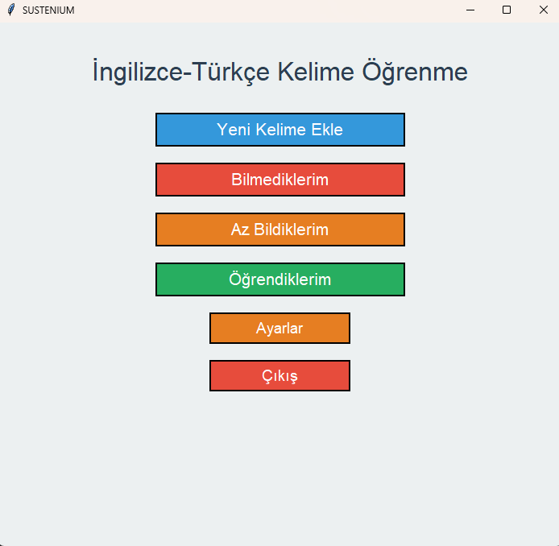
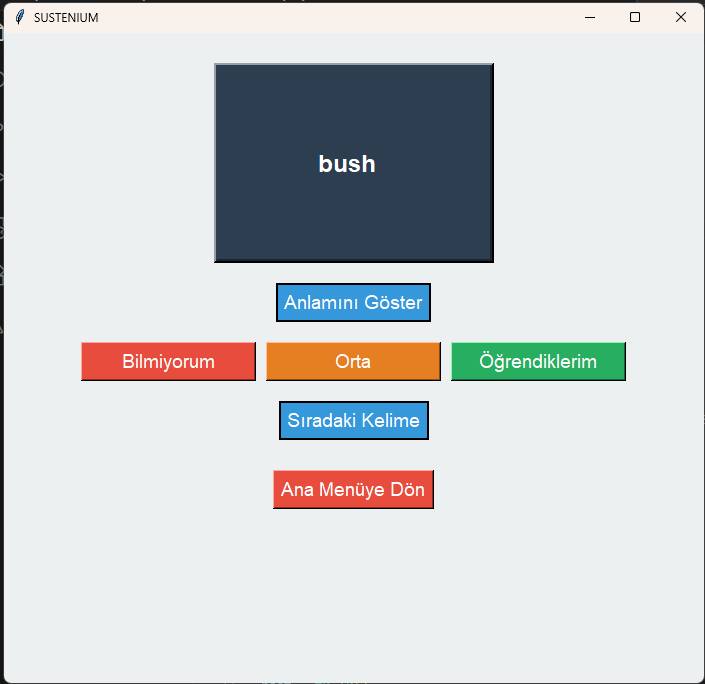
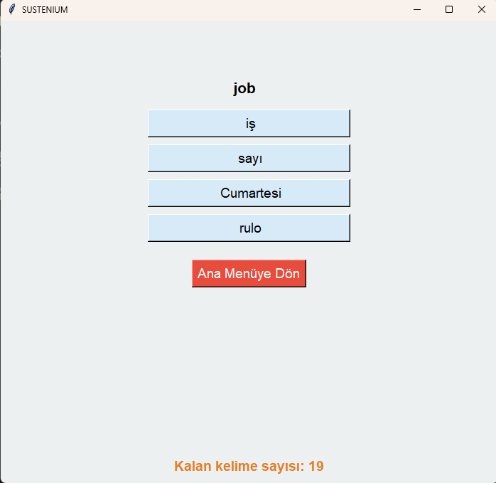

# Sustenium - Aralıklı Tekrar (Spaced Repetition) ile Kelime Öğrenme Uygulaması

Bu proje, **Oxford 3000** kelime listesini kullanarak İngilizce kelime öğrenimini daha verimli ve kalıcı hale getirmeyi amaçlayan, **Python** ve **Tkinter** ile geliştirilmiş bir masaüstü uygulamasıdır. Uygulamanın temelinde, öğrenilen bilgilerin unutulmasını engellemek için bilimsel olarak kanıtlanmış **Aralıklı Tekrar (Spaced Repetition)** tekniği yatmaktadır.

<br>



---

## 🌟 Temel Özellikler

- **Modern ve Kullanıcı Dostu Arayüz:** Tkinter kullanılarak tasarlanmış, sade ve estetik bir arayüz.
- **Akıllı Tekrar Algoritması:** Bir kelimeyi doğru bildiğinizde tekrar süresini uzatan, bilemediğinizde ise size daha sık sorarak öğrenmeyi pekiştiren akıllı bir sistem.
- **Zengin Veritabanı:** Her kelime için Türkçe anlamı, CEFR seviyesi (A1-B2), kelime türü (isim, fiil vb.) ve kelimenin kullanımını gösteren bir örnek cümle içerir.
- **İlerleme Kaydı:** Tüm öğrenme ilerlemeniz `category_data.json` dosyasına kaydedilir, böylece uygulamayı kapatıp açtığınızda kaldığınız yerden devam edebilirsiniz.
- **Kolay Kurulum:** Harici olarak sadece `pandas` ve `openpyxl` kütüphanelerini gerektirir.

---

## 🖼️ Ekran Görüntüleri

| Yeni Kelime Öğrenme | Öğrenilen Kelimenin Tekrarı |
| :---: | :---: |
| *Uygulama, size daha önce görmediğiniz yeni bir kelime sunar.* | *Tekrar zamanı geldiğinde, daha önce öğrendiğiniz bir kelime karşınıza çıkar.* |
|  |  |

---

## 💻 Kullanılan Teknolojiler

- **Python 3.x**
- **Tkinter:** Görsel masaüstü arayüzü için kullanılmıştır.
- **Pandas & Openpyxl:** `The_Oxford_3000.xlsx` Excel dosyasını verimli bir şekilde okumak ve yönetmek için kullanılmıştır.
- **JSON:** Öğrenme takvimini ve ilerlemeyi kaydetmek için kullanılmıştır.

---

## 🛠️ Kurulum ve Kullanım

### Gereksinimler
- Python 3.x
- `pandas` ve `openpyxl` kütüphaneleri

### Kurulum

1.  **Projeyi Klonlayın veya İndirin:**
    ```bash
    git clone [SENİN_GITHUB_REPO_LİNKİN]
    cd [PROJE_KLASOR_ADIN]
    ```
2.  **Sanal Ortam Oluşturun ve Aktif Edin (Tavsiye Edilir):**
    ```bash
    python -m venv .venv
    # Windows için:
    .\.venv\Scripts\Activate.ps1
    # macOS/Linux için:
    # source .venv/bin/activate
    ```
3.  **Gerekli Kütüphaneleri Yükleyin:**
    ```bash
    pip install -r requirements.txt
    ```
4.  **Veritabanı Dosyasını Kontrol Edin:**
    `The_Oxford_3000.xlsx` dosyasının ana proje klasöründe olduğundan emin olun.

### Çalıştırma

Uygulamayı başlatmak için terminalden aşağıdaki komutu çalıştırın:
```bash
python main.py
```

---

## 🗂️ Dosya Yapısı

- **`main.py`**: Uygulamanın ana mantığını, arayüzünü ve aralıklı tekrar algoritmasını içerir.
- **`The_Oxford_3000.xlsx`**: Kelimeleri, anlamlarını, seviyelerini, türlerini ve örnek cümleleri barındıran ana veri kaynağıdır.
- **`category_data.json`**: Her kelimenin öğrenme seviyesini ve bir sonraki tekrar tarihini tutar. Kullanıcının ilerlemesi bu dosyada saklanır.
- **`requirements.txt`**: Projenin çalışması için gerekli Python kütüphanelerini listeler.
- **`images/`**: Arayüz ekran görüntülerini içeren klasördür.